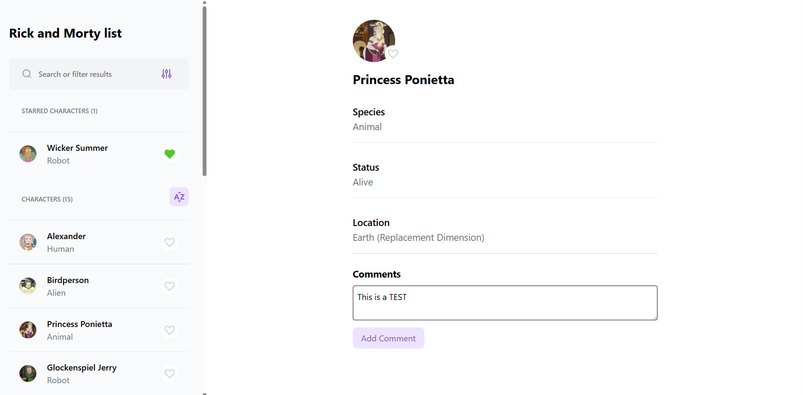
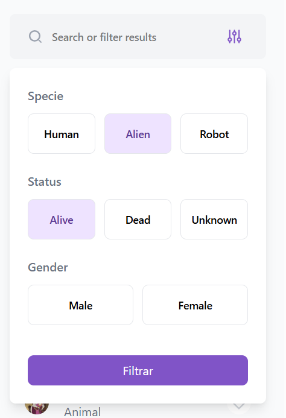

# rick-morty-app

Una aplicación web para acceder a los datos de los personajes de Rick y Morty. Esta aplicación esta hecha en conjunto con [este servicio API](https://github.com/fabiloco/rick-morty-api) en GraphQL.

Tecnologias usadas:

- ReactJS
- React Router v6
- GraphQL (ApolloClient)
- Tailwind
- Typescript

### Funcionalidades

El aplicativo permite la visualización de los personajes de la serie, sus datos, y además permite al usuario dejar comentarios en ellos y marcarlos como favortios.



También se cuenta con un sistema de filtrado y busqueda, para encontrar personajes.




## Pasos para correr el proyecto

Antes que nada, se debe agregar el archivo `.env` y agregar a este una variable de entorno, que será la ruta de la API de GraphQL mencionada.

```
VITE_API_URL=http://localhost:4000/graphql
```

Luego, se pueden instalar las dependencias:

```
pnpm i
```

Y finalmente, ejectar el proyecto de desarrollo

```
pnpm run dev
```